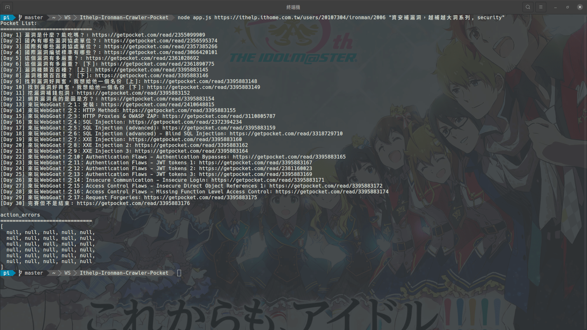

# Ithelp Ironman Crawler Pocket

最近入手了一台樂天的電子閱讀器，因為內建有整合 Pocket 這套瀏覽器書籤，且我很喜歡讀 **iT 邦幫忙鐵人賽** 系列文章，不管是複習已知資訊，或這是快速的了解一個領域。但是需要一個一個頁面添加太麻煩了（有完賽的文章通常有 30 頁 up），所以自動化是肯定的 (ﾟ∀ﾟ)

## Run Project

### Step 1. 取得 Pocket consumer_key, access_token

```
cp default.config.json config.json
vim config.json
```

### Step 2. 下載腳本

```
git clone https://github.com/VagrantPi/Ithelp-Ironman-Crawler-Pocket.git
cd Ithelp-Ironman-Crawler-Pocket
yarn
```

### Step 3. 添加文章

```
node app.js URL "Tag,Tag,Tag"
```


